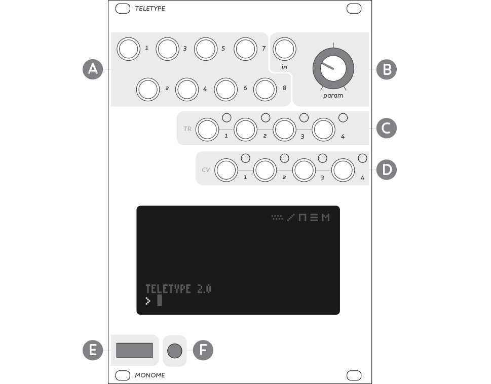
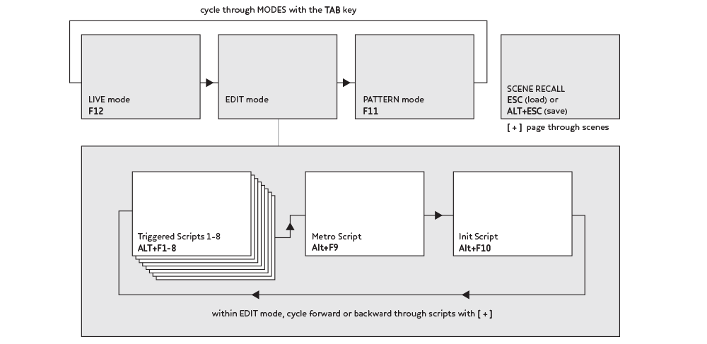

# Overview

## Panel

A. Trigger inputs 1-8 - Sending a pulse or rising edge of a gate to these inputs causes their respective scripts to execute. The detection threshold is 0.?V. Both audio rate and control signals are accepted.

B. In & Param - Values of the CV input (0-10V range) and param knob can be read into teletype. The knob and in jack can be used to set and replace values within the teletype environment. The param knob can also be used to scroll presets once you have pressed scene recall or directly adjust values in the pattern mode while holding the appropriate modifier keys on the keyboard.

C. TR outputs 1-4 - Outputs gate or trigger signals (0-5V). Labelled A-D on earlier units.

D. CV outputs 1-4 -- Outputs CV values (0-10V).

E. USB port - The USB port has several purposes. It is used to connect the included keyboard for typing commands and interacting w/ teletype. With a jump drive attached to the USB you can save scripts or upload saved scripts to the unit. Teletype additionally uses this port to receive firmware updates by connecting to a computer using a USB A-A cable. Current community development is underway in adding grid based interaction via USB.

F. Scene Recall - allows you to select scenes without a keyboard attached to teletype.

## Interface Navigation

## LIVE mode

Teletype starts up in LIVE mode, you’ll see a friendly **>** prompt in the lower left corner of the screen. If for some reason this is not the case hit the `TAB` key until you see the **>** prompt (`TAB` cycles through LIVE, EDIT, and PATTERN mode. We’ll be working with all these shortly).

LIVE mode allows the user to interact directly with teletype by entering commands on the keyboard. Commands are limited to 30 characters, and each command is executed immediately upon hitting enter.

Let’s try some basic commands:

    TR.TOG 1

will toggle trigger 1 after pressing enter. Next, consider:

    CV 1 V 5
    CV 2 N 7
    CV 1 0

Here the first command sets CV 1 to 5 volts. The second command sets CV 2 to note 7 (which is 7 semitones up). The last command sets CV 1 back to 0.

Data flows from right to left, so it becomes possible to do this:

    CV 1 N RAND 12

Here a random note between 0 and 12 is set to CV 1.

We can change the behavior of a command with a *PRE* such as `DEL`:

    DEL 500 : TR.TOG 1

`TR.TOG 1` will be delayed by 500ms upon execution.

### Some helpful bits:

* A display line appears above the command line in dim font. Here any entered commands will return their numerical value if they have one.

* You can scroll through your history of commands using the up and down arrows.

* You can copy and paste the currently selected command for use in a script using `ALT+C` & `ALT+V`.

* Navigate directly to live mode with `F12`.

### LIVE mode icons
Five small icons are displayed in LIVE mode to give some important feedback about the state of Teletype. These icons will be brightly lit when the above is true, else will remain dim. They are, from left to right:
* Trigger Mutes: 8 dots indicate the 8 trigger inputs. Bright dots indicate muted triggers
* Slew: CV outputs are currently slewing to a new destination.
* Delay: Commands are in the delay queue to be executed in the future.
* Stack: Commands are presently on the stack waiting for execution.
* Metro: Metro is currently active and the Metro script is not empty.

## EDIT mode

*SCRIPTS*, a group of up to 6 commands, can be assigned to each of the 8 trigger inputs. This is when things get musically interesting. To edit a script, we shift into EDIT mode. To enter EDIT mode from LIVE mode hit `TAB` (recall: `TAB` rotates through modes in the following order: EDIT, LIVE, PATTERN)

Where in edit mode a **>** prompt was in the bottom left corner of the screen, in EDIT mode you will see a character indicating which script you are editing:

* `1`-`8` indicates the script associated with corresponding trigger
* `M` is for the internal metronome
* `I` is the init script, which is executed upon scene recall

You can rotate through these 10 scripts using the bracket keys `[`and`]`.After typing a command into EDIT mode you must press `Return`in order to store it into the highlighted line in your Script. The up/down arrows allow you to select different lines to edit.

Script 1 will be executed when trigger input 1 (top left jack on the panel) receives a low-to-high voltage transition (trigger, or front edge of a gate). Consider the following as script 1:

1:

    TR.TOG 1

Now when input 1 receives a trigger, `TR.TOG 1` is executed, which toggles the state of Trigger 1.

Scripts can have multiple lines:

1:

    TR.TOG 1
    CV 1 V RAND 4

Now each time input 1 receives a trigger, CV 1 is set to a random volt between 0 and 4, in addition to output trigger 1 being toggled.

### Metronome

The `M` script is driven by an internal metronome, so no external trigger is required. By default the metronome interval is 1000ms. You can change this readily (for example, in LIVE mode):

    M 500

The metronome interval is now 500ms. You can disable/enable the metronome entirely with `M.ACT`:

    M.ACT 0

Now the metronome is off, and the `M` script will not be executed. Set `M.ACT` to 1 to re-enable.

### Init Script

The *INIT* script (represented as `I`) is executed when a preset is recalled. This is a good place to set initial values of variables if needed, like metro time `M` or time enable `TIME.ACT` for example.

## Patterns

Patterns facilitate musical data manipulation-- lists of numbers that can be used as sequences, chord sets, rhythms, or whatever you choose. Pattern memory consists of four banks of 64 steps. Functions are provided for a variety of pattern creation, transformation, and playback. The most basic method of creating a pattern is by directly adding numbers to the sequence. In LIVE mode try:

    P.PUSH 5
    P.PUSH 11
    P.PUSH 9
    P.PUSH 3

`P.PUSH` adds the provided value to the end of the list-- patterns keep track of their length, which can be read or modified with `P.L`. Now the pattern length is 4, and the list looks something like:

    5, 11, 9, 3

Patterns also have an index `P.I`, which could be considered a playhead. `P.NEXT` will advance the index by one, and return the value stored at the new index. If the playhead hits the end of the list, it will either wrap to the beginning (if `P.WRAP` is set to 1, which it is by default) or simply continue reading at the final position.

So, this script on input 1 would work well:

1:

    CV 1 N P.NEXT

Each time input 1 is triggered, the pattern moves forward one then CV 1 is set to the note value of the pattern at the new index. This is a basic looped sequence. We could add further control on script 2:

2:

    P.I 0

Since `P.I` is the playhead, trigger input 2 will reset the playhead back to zero. It won't change the CV, as that only happens when script 1 is triggered.

We can change a value within the pattern directly:

    P 0 12

This changes index 0 to 12 (it was previously 5), so now we have *12, 11, 9, 3.*

We've been working with pattern `0` up to this point. There are four pattern banks, and we can switch banks this way:

    P.N 1

Now we're on pattern bank 1. `P.NEXT`, `P.PUSH`, `P`, (and several more commands) all reference the current pattern bank. Each pattern maintains its own play index, wrap parameter, length, etc.

We can directly access and change *any* pattern value with the command `PN`:

    PN 3 0 22

Here the first argument (3) is the *bank*, second (0) is the *index*, and last is the new value (22). You could do this by doing `P.N 3` then `P 0 22` but there are cases where a direct read/write is needed in your patch. In Teletype v2.0 all `P` operators have equivalent `PN` operators which allow quick access to any of the 4 patterns and saves script length.

Patterns are stored in flash with each scene!

### PATTERN mode

Editing patterns with scripts or from the command line isn't always ergonomic. When you'd like to visually edit patterns, PATTERN mode is the way.

`TAB` through the modes to get to PATTERN mode. It's after EDIT mode, and displays the current pattern memory in a 4 column matrix of values. You can also get directly to PATTERN mode by pressing the `NUM LOCK` key.

Use the arrow keys to navigate. Holding `ALT` will jump by pages.

The edit position is indicated by the brightest number. Very dim numbers indicate they are outside the pattern length.

Use the square bracket keys `[` and `]` to decrease/increase the values. Backspace sets the value to 0. Entering numbers will overwrite a new value. You can cut/copy/paste with `ALT-X-C-V`.

## Scenes

A *SCENE* is a complete set of scripts and patterns. Stored in flash, scenes can be saved between sessions. Many scenes ship as examples. On startup, the last used scene is loaded by Teletype.

Access the SCENE menu using `ESCAPE`. The bracket keys (`[` and `]`) navigate between the scenes. Use the up/down arrow keys to read the scene *text*. This text will/should describe what the scene does generally along with input/output functions. `ENTER` will load the selected scene, or `ESCAPE` to abort.

To save a scene, hold `ALT` while pushing `ESCAPE`. Use the brackets to select the destination save position. Edit the text section as usual-- you can scroll down for many lines. The top line is the name of the scene. `ALT-ENTER` will save the scene to flash.

### Keyboard-less Scene Recall

To facilitate performance without the need for the keyboard, scenes can be recalled directly from the module's front panel.

* Press the `SCENE RECALL` button next to the USB jack on the panel.
* Use the `PARAM` knob to highlight your desired preset.
* Hold the `SCENE RECALL` button for 1 second to load the selected scene.

## Teletype Syntax

* SCRIPT -- multiple *commands*
* COMMAND -- a series (one line) of *words*
* WORD -- a text string separated by a space: *value*, *operator*, *variable*, *mod*
* VALUE -- a number
* OPERATOR -- a function, may need value(s) as argument(s), may return value
* VARIABLE -- named memory storage ie X, Y, or Z
* MOD/PRE? -- condition/rule that applies to rest of the *command*, ie DEL, PROB, IF

Teletype uses [prefix notation](https://en.wikipedia.org/wiki/Polish_notation). Evaluation happens from right to left. The left value gets assignment (*set*).

Here, temp variable `X` is assigned zero:

    X 0

Temp variable `Y` is assigned to the value of `X`:

    Y X

`X` is being *read* (*get* `X`), and this value is being used to *set* `Y`.

Instead of numbers or variables, we can use operators to perform more complex behavior:

    X TOSS

`TOSS` returns a random state, either 0 or 1 on each call.

Some operators require several arguments:

    X ADD 1 2

Here `ADD` needs two arguments, and gets 1 and 2. `X` is assigned the result of `ADD`, so `X` is now 3.

If a value is returned at the end of a command, it is printed as a MESSAGE. This is visible in LIVE mode just above the command prompt. (In the examples below ignore the // comments).

    8           // prints 8
    X 4
    X           // prints 4
    ADD 8 32    // prints 40

Many parameters are indexed, such as CV and TR. This means that CV and TR have multiple values (in this case, each has four.) We pass an extra argument to specify which index we want to read or write.

    CV 1 0

Here CV 1 is set to 0. You can leave off the 0 to print the value.

    CV 1        // prints value of CV 1

Or, this works too:

    X CV 1      // set X to current value of CV 1

Here is an example of using an operator `RAND` to set a random voltage:

    CV 1 V RAND 4

First a random value between 0 and 3 is generated. The result is turned into a volt with a table lookup, and the final value is assigned to CV 1.

The order of the arguments is important, of course. Consider:

    CV RRAND 1 4 0

`RRAND` uses two arguments, 1 and 4, returning a value between these two. This command, then, chooses a random CV output (1-4) to set to 0. This might seem confusing, so it's possible to clarify it by pulling it apart:

    X RRAND 1 4
    CV X 0

Here we use `X` as a temp step before setting the final CV.

With some practice it becomes easier to combine many functions into the same command.

Furthermore, you can use a semicolon to include multiple commands on the same line:

    X RRAND 1 4; CV X 0

This is particularly useful in **INIT** scripts where you may want to initialize several values at once:

    A 66; X 101; TR.TIME 1 20;

## Continuing

Don't forget to checkout the [Teletype Studies](https://monome.org/docs/modular/teletype/studies-1) for an example-driven guide to the language.
